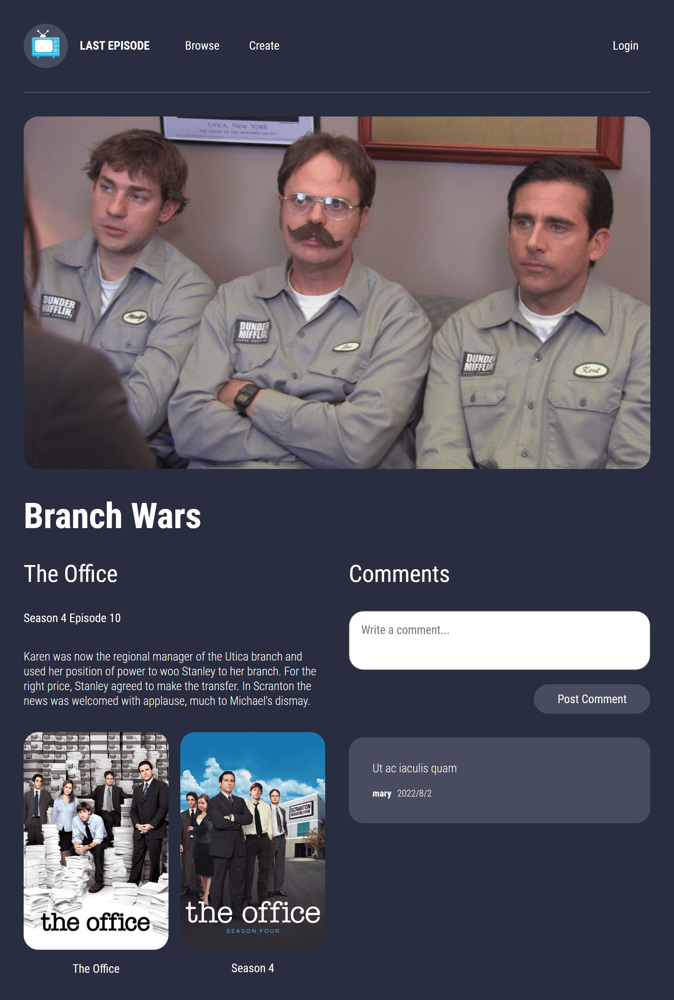

# Last Episode

A web app where you can post episodes of TV shows to talk about with users. After signing up, users can login to post episodes, post comments on existing episodes, and view episodes they have commented on via their user page.

Built with React, React Router, MongoDB, Express, Styled Components, REST, TMDB API, and JWT.

